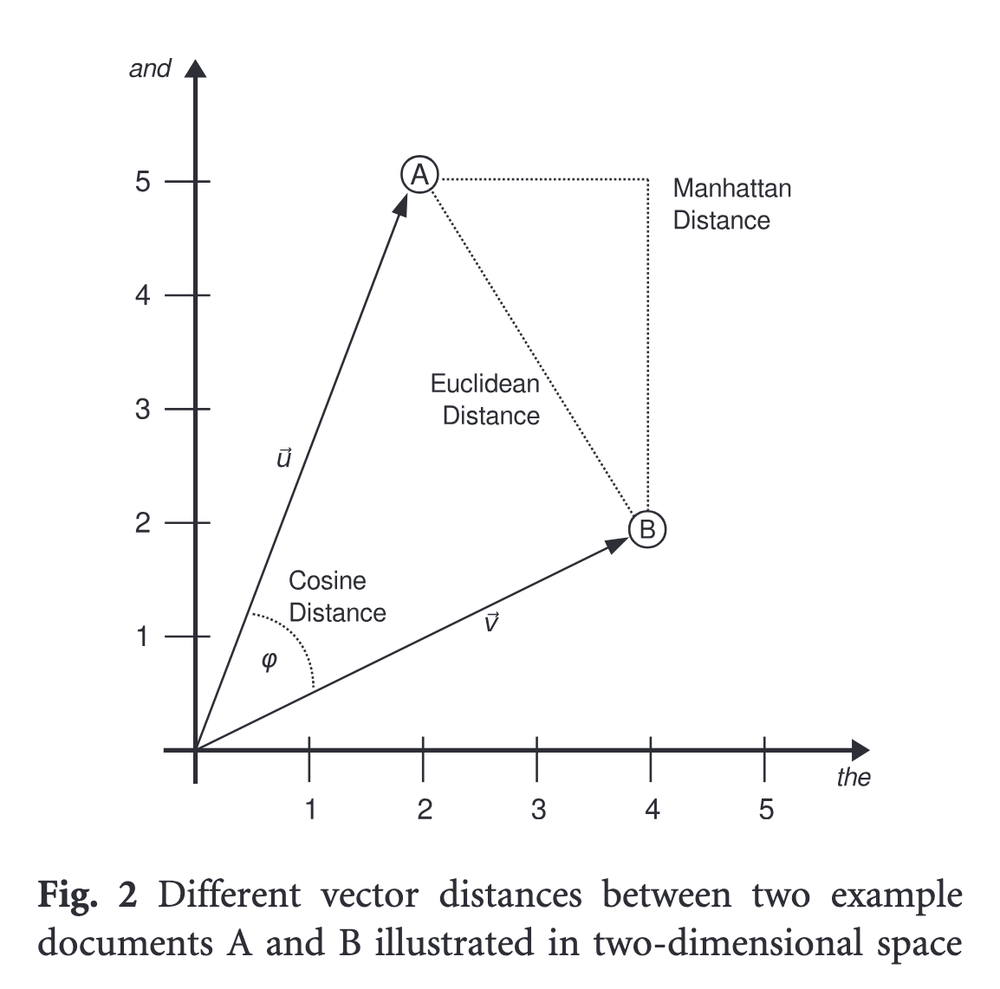
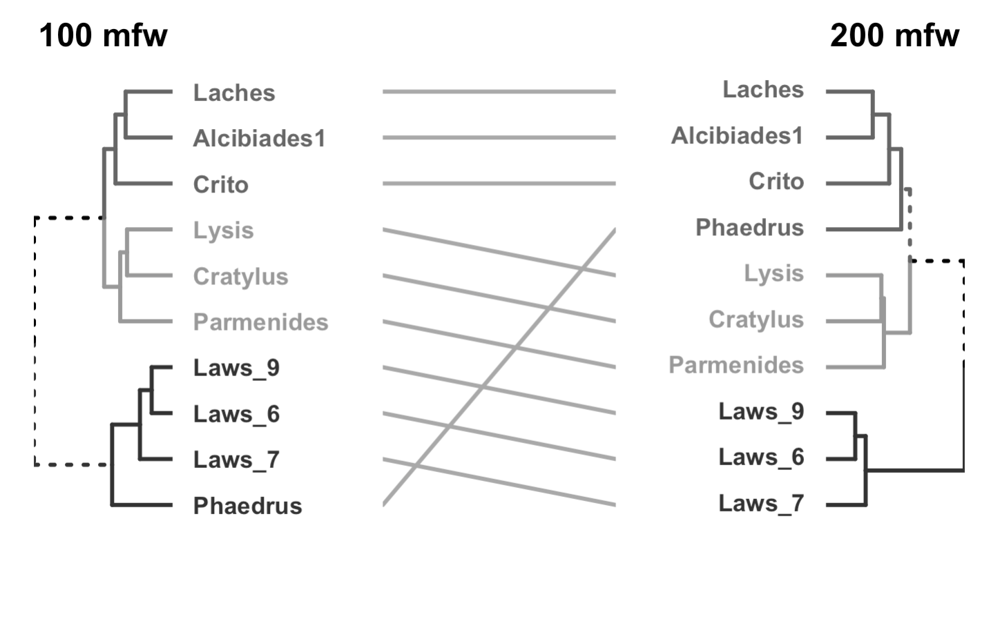
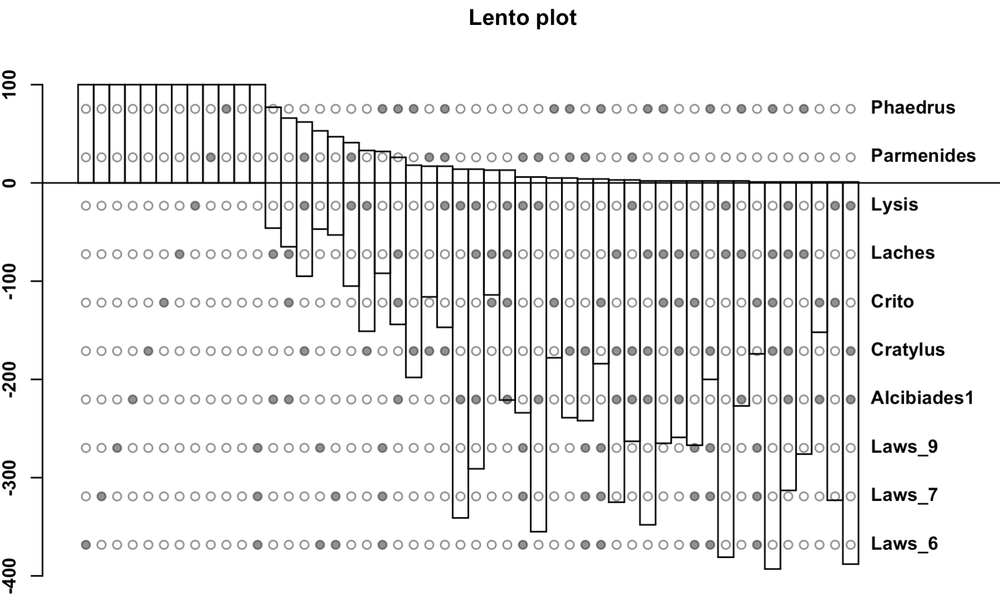
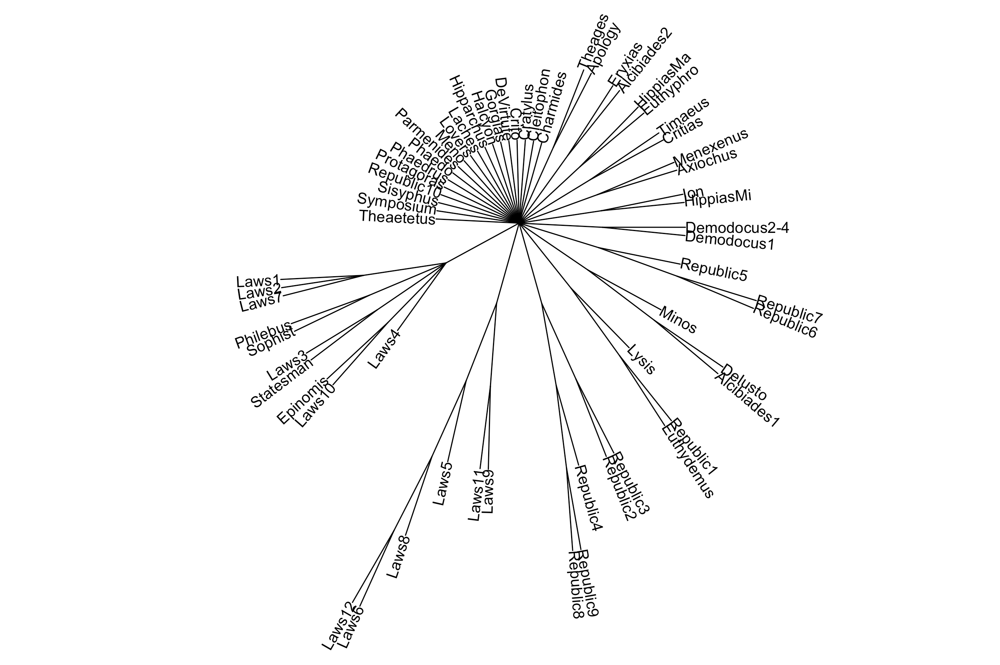
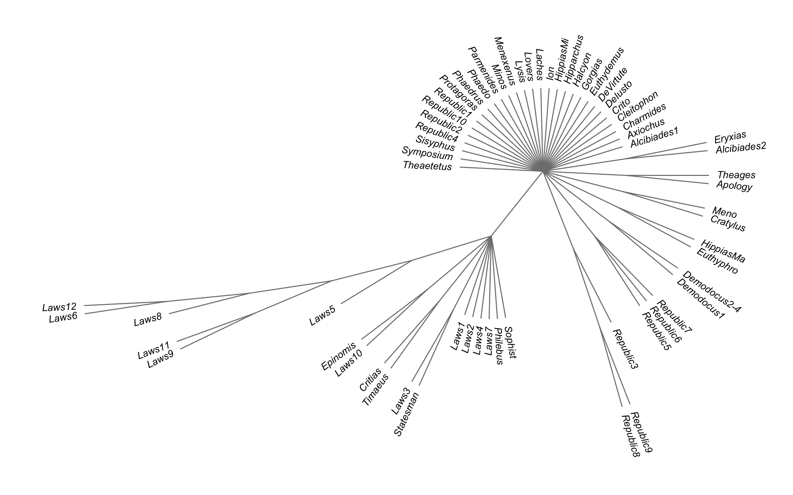
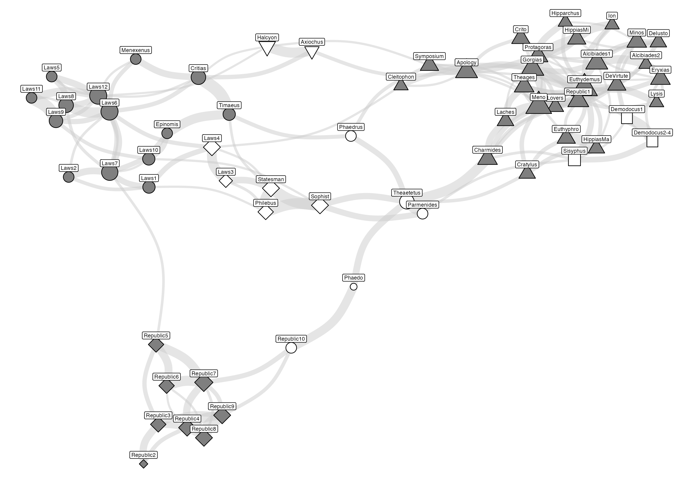
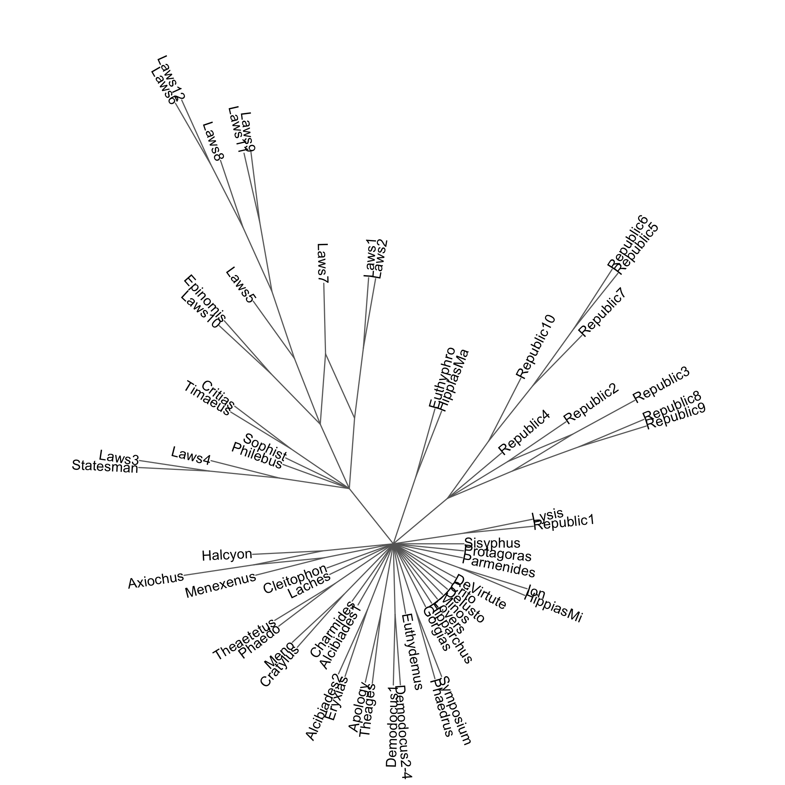
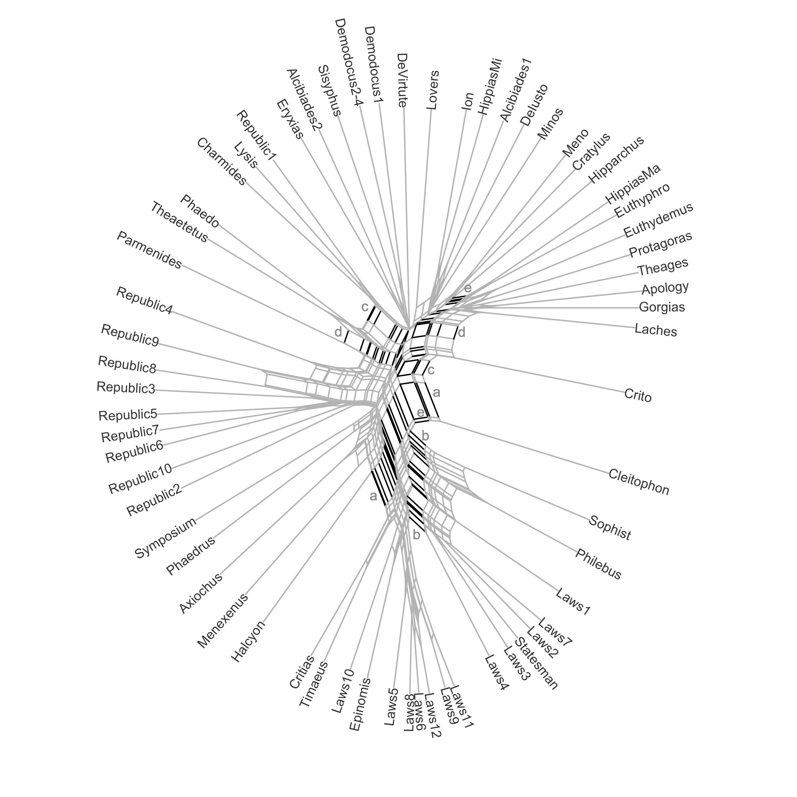

## 1: Objectives

- To reassess the standard tripartite chronology of Platonic dialogues
   - Dialogues categorized as early, middle, and late
   - Widely accepted by Developmentalists (Guthrie, Vlastos) and Unitarists (Kahn)

- To evaluate phylogenetic clustering methods in literary stylometry
   - Phylogeny: evolution-based classification (trees, clusters)
   - Phenetic (distance-based) methods: no assumption of lineage


## 2: Key Issues in Stylometry of Plato

- No reliable dates for most dialogues
- Only one clear source: Aristotle says Laws > Republic
- Classification vs Regression:
  - We are predicting categories, not numeric years
- Therefore, focus = Clustering (Unsupervised Learning)


## 3: Step One:  Build Document-Term Matrices (DTMs)

- Represent documents numerically: most Frequent Words (MFW)

```{r echo=FALSE}
library(tidyverse)
library(gt)
load("./data/dtms.Rdata")
dtms[[1]] |> 
  rownames_to_column("title") |> 
  slice_head(n = 5) |>
  gt() |> 
  fmt_number(
    columns = where(is.numeric),
    decimals = 3
  ) |> 
  opt_stylize(style = 1, color = "gray", add_row_striping = TRUE)

```


## 4: Step Two: Measuring Distance

- Distance metric:  Cosine Similarity with standardization ([Würzburg Delta](https://academic.oup.com/dsh/article/32/suppl_2/ii4/3865676))




## 5: Step Three: Hierarchical clustering

- Visualize clusters → dendrograms
- Unstable results:
  - Sensitive to # of MFW, distance metric, linkage method
  - Different algorithms yield different trees
- Solution: Use many trees → measure stability

---



##  6: Bootstrap to the Rescue

- Bootstrap sampling (over features) to confirm:
  - Are clusters real or accidental?
- Assess support/conflict for each split:
  - Lento plots
  - Consensus trees
  
---


## 7: Terms You’ll Hear Often

- Split = binary partition of a tree
- Support = how often the split appears
- Conflict = how many opposing splits exist
- Lento Plot: visual summary of the above across many trees

---




## 9: Consensus Trees: General Idea

```{r echo=FALSE}
library(ape)
library(purrr)

# Define trees
tr1 <- read.tree(text = "((1,2),(3,4));")
tr2 <- read.tree(text = "((1,3),(2,4));")
tr3 <- read.tree(text = "((1,2),(3,4));")

# Create consensus tree
cons <- consensus(list(tr1, tr2, tr3), p = 0.5, rooted = TRUE)

# 2x2 plot layout
par(mfrow = c(2, 2), mar = c(2,1,3,1), cex = 0.9)

# Plot input trees
walk(list(tr1, tr2, tr3), plot.phylo, 
     tip.color = "firebrick", 
     font = 2, edge.width = 2, label.offset = 0.1)

# Plot consensus tree
plot.phylo(cons, tip.color = "firebrick", font = 2, 
           edge.width = 2, label.offset = 0.05, main = "Consensus Tree")

# Add support labels
nodelabels(round(cons$node.label[3],2), 7, 
           frame = "c", cex = 0.7, 
           bg = "firebrick", col = "white", font = 2)
nodelabels(round(cons$node.label[2],2), 6, 
           frame = "c", cex = 0.7,
           bg = "firebrick", col = "white", font = 2)

```


## 10: Stylo Consesus Tree

> For minimum = 100, maximum = 3000, and increment = 50, stylo will run subsequent analyses for the following frequency bands: 100 MFW, 50–150 MFW, 100–200 MFW, ..., 2900–2950 MFW, 2950–3000 MFW. This is an attractive feature because it enables the assessment of similarities between texts across different bands in the frequency spectrum.  -- [Source](https://journal.r-project.org/archive/2016/RJ-2016-007/RJ-2016-007.pdf)

---



## 11: Phangorn Consensus Tree




## 12: Consensus Trees vs. Consensus Networks

- Consensus Trees: 
  - Only show splits > 50% 
  - Obscure partial / conflicting signals
  - More data → more root-connected branches

- Consensus Network
  - Captures conflicting or partial support
  - Widely used in: linguistics, genetics, anthropology
  - Shows ambivalent affiliations between texts

## 13: Stylo Network

- Stylo method:
  - Scores for 1st, 2nd, 3rd neighbors
  - Aggregated into weighted edges (1–66)
- Visualized with igraph + ggraph
- Clustered

--- 




## 15: Bootstrapped Tree Networks (Phangorn)




## 16: NeighborNet Method

- Builds graph directly from distance matrix
- Works in two steps: 
  - constructs a circular collection of splits (partitions); 
  - calculates weights for the splits (least squares method)
  
---




## 17: Key Observations

- “Late” cluster dominates every experiment, but is it really late?
- “Early” group = non-existent in stylometry
- Some stable pairs: e.g., Meno + Cratylus, Lysis + Republic 1
- Texts like Clitophon resist classification
- Pseudoplatonica often cluster with “Socratic” dialogues


## 18: Feedback

```{=html}
<!-- Load Font Awesome (make sure this is in your HTML head) -->
<link rel="stylesheet" href="https://cdnjs.cloudflare.com/ajax/libs/font-awesome/6.5.0/css/all.min.css">

<!-- Icon List -->
<ul class="icon-list">
  <li><i class="fab fa-telegram"></i> @locusclassicus </li>
  <li><i class="fas fa-envelope"></i> alieva.mgl@gmail.com </li>
  <li><i class="fab fa-github"></i> github.com/locusclassicus </li>
  <li><i class="fas fa-graduation-cap"></i> hse-ru.academia.edu/OlgaAlieva</li>
</ul>

<!-- Optional CSS for styling -->
<style>
  .icon-list {
    list-style: none;
    padding: 0;
    margin: 1em 0;
  }

  .icon-list li {
    margin: 0.5em 0;
    font-size: 1.2em;
    display: flex;
    align-items: center;
  }

  .icon-list i {
    margin-right: 0.5em;
    color:  #107895;
    width: 1.2em;
    text-align: center;
  }
</style>
```
